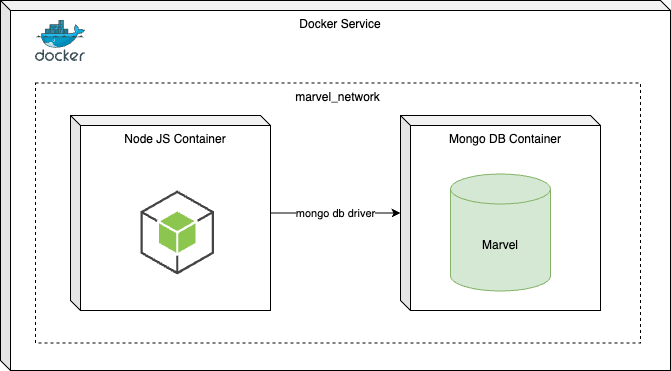

# Marvel characters extractor

The following project involves the development of a script that retrieves the list of characters appearing in Marvel comics API along with the character Spectrum.

The container-based infrastructure was implemented using Docker and Docker Compose.


## Architecture

Below is a diagram illustrating the infrastructure:



**Node JS Container**: This container is provisioned with an Alpine image and Node.js 20. It contains the script that runs once when the container is started, executing the code to retrieve the characters and store them in the MongoDB database.

**MongoDB Container**: This container is provisioned with a MongoDB database. It stores the list of characters. Access to this container is possible using a UI client for MongoDB, such as MongoDB Compass (available for download from the following link: https://www.mongodb.com/try/download/compass).

**marvel_network**: This bridge-type network encapsulates the aforementioned services and allows external connections to the containers.


## Configuration Environment Instructions:

1. Run the following command to build the image containing the necessary code to execute the script. This build process will create the container with the script, add the necessary environment variables, install dependencies, and finally execute the ENTRYPOINT to run the script.

```
docker-compose build
```

2. Now, execute the following command to deploy the previously built infrastructure. This command will start the container with the script service and the MongoDB database.

```
docker-compose up
```

## Notes
* The code includes a set of unit tests that validate the logic of the functions.

* After running the docker-compose up command, you'll be able to access the database named Marvel and the collection named Characters using the following credentials:

    * Mongo host: localhost
    * Mongo port: 27017
    * Mongo db name: marvel
    * Mongo username: root
    * Mongo password: c@ptainAm3rica

* The "Characters" collection contains a list of documents that were extracted during the script execution. Each document includes the following fields:

    * id: The unique identifier for the Marvel character.
    * name: The name of the character.
    * description: A brief description of the character.
    * thumbnail: An image url representing the character.